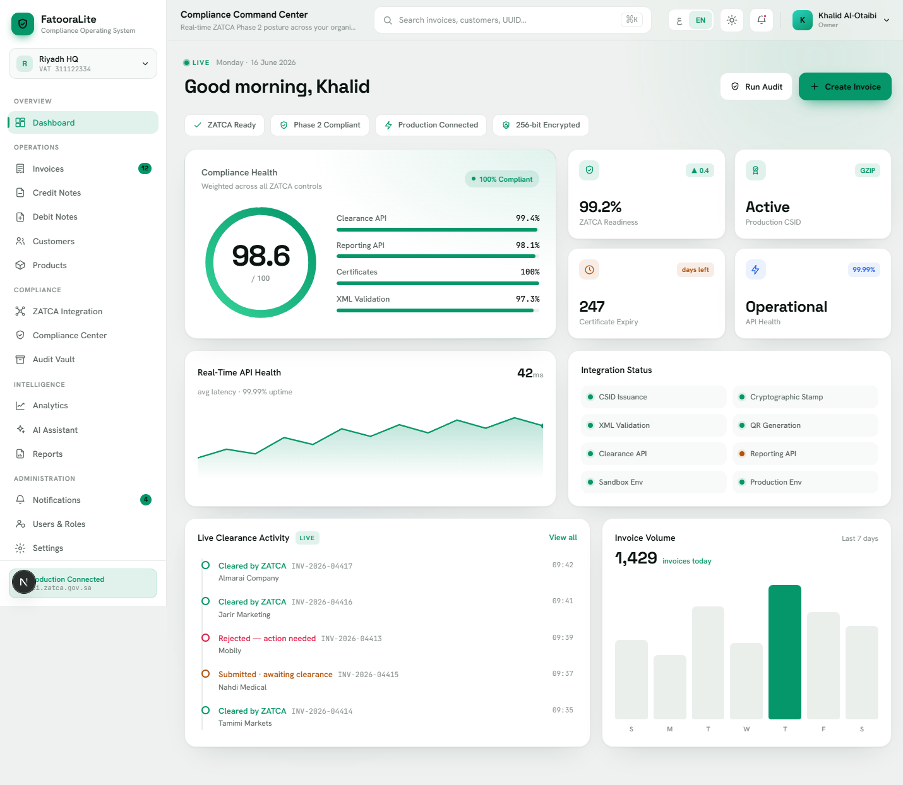
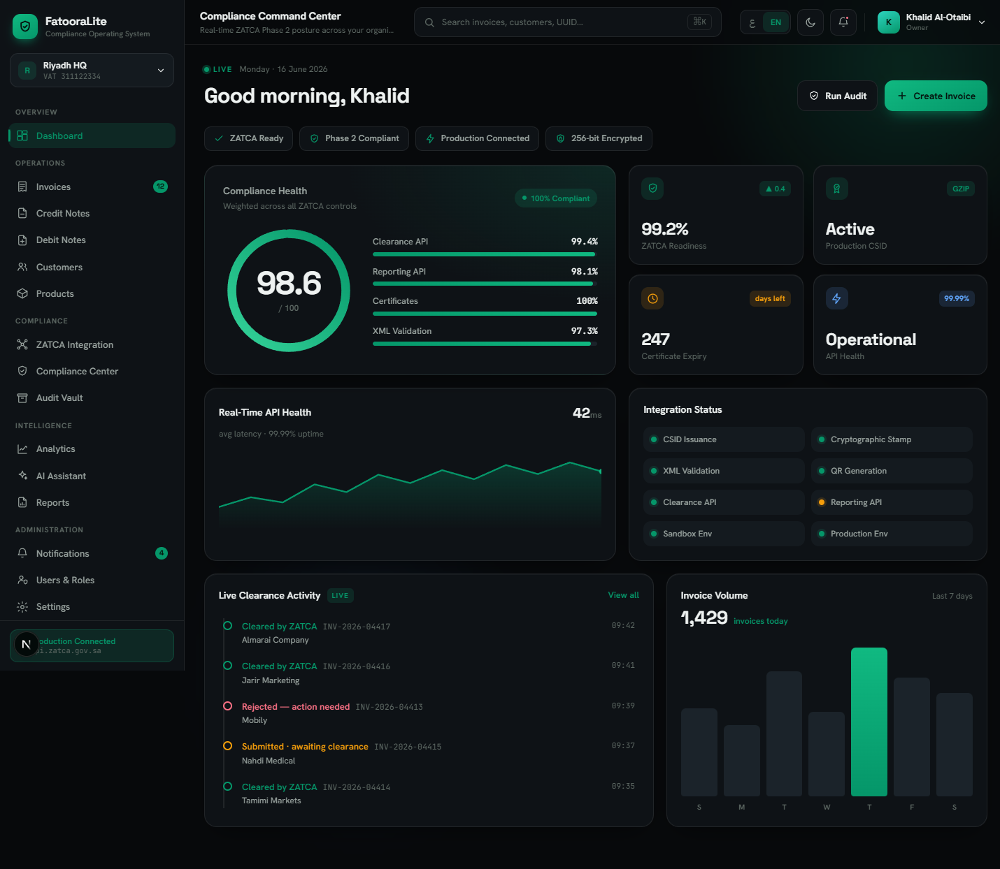
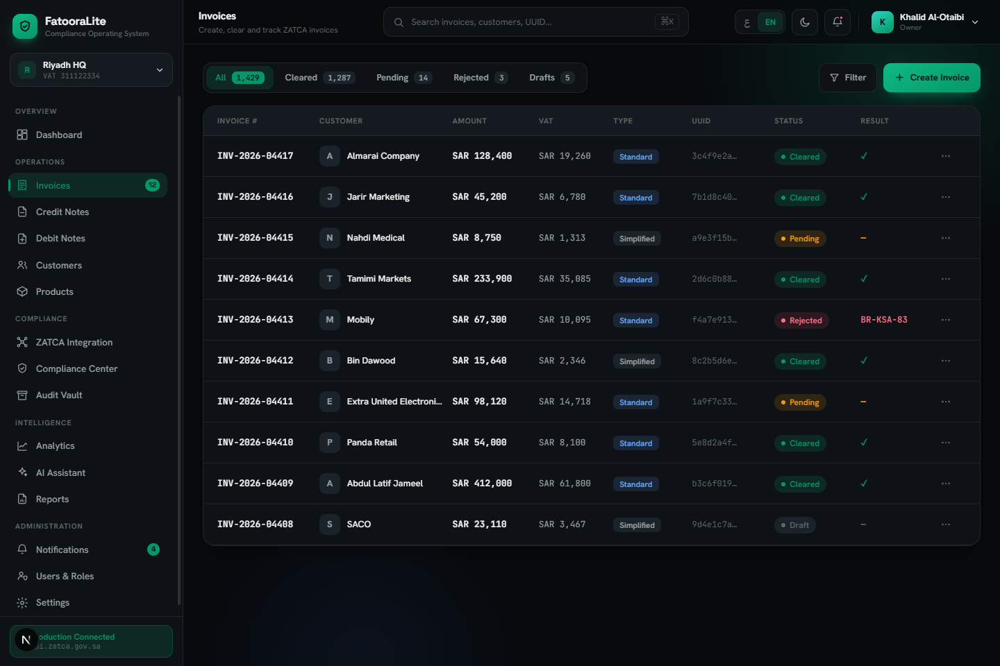
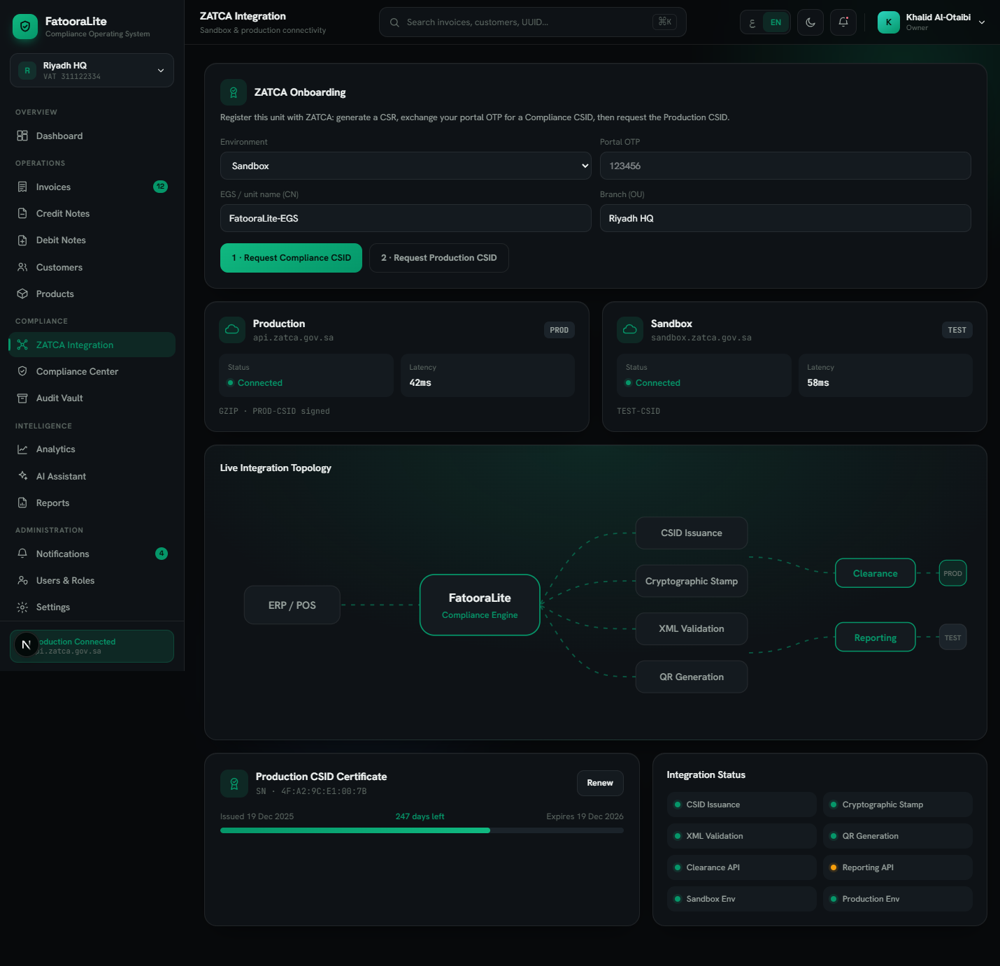
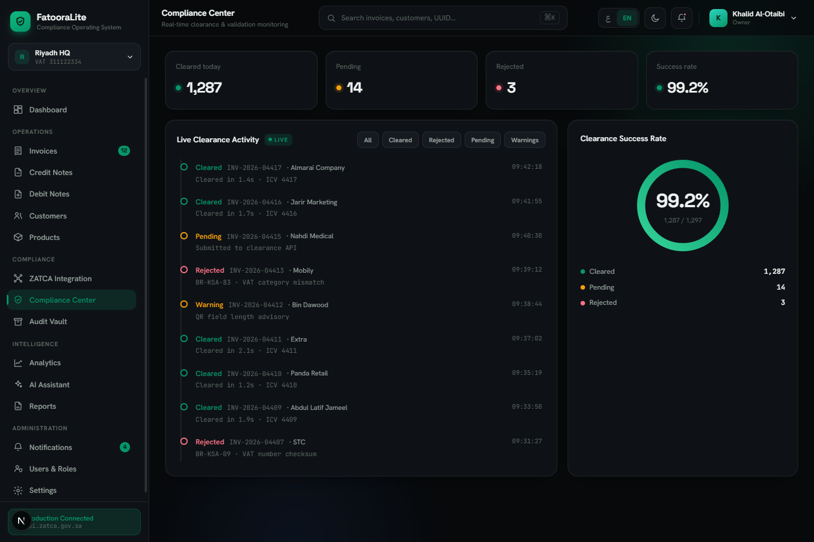
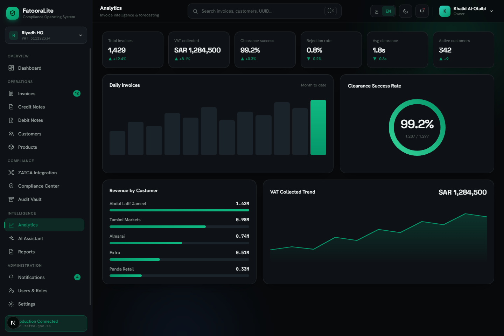
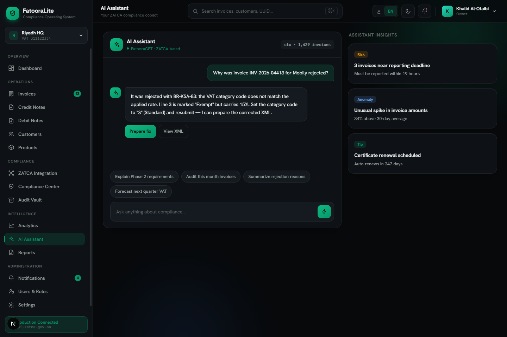
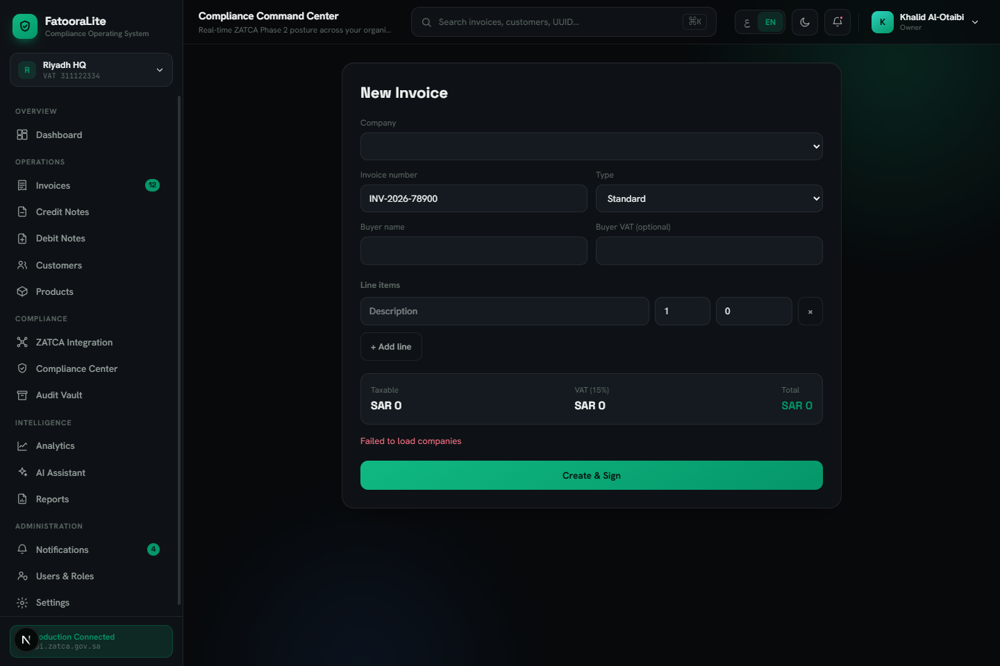
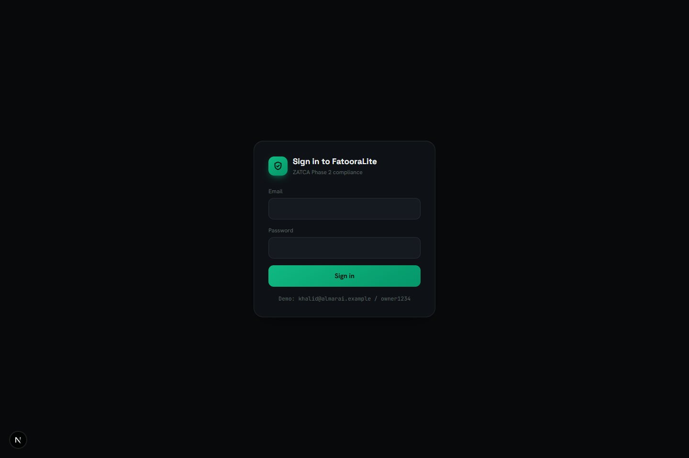

<div align="center">

# FatooraLite

### ZATCA Phase 2 e-invoicing compliance for Saudi SMEs

Compliance-first. Bilingual (Arabic-RTL / English). Dark & light. Installable PWA.

[](https://github.com/ak1458/fatooralite/actions/workflows/ci.yml)
[](LICENSE)




</div>

---

## Overview

**FatooraLite** turns an invoice into a ZATCA Phase-2 compliant, cryptographically
stamped document, clears/reports it through the Fatoora gateway, and keeps an
auditable archive — through a clean, Arabic-first interface. It is built for
owner-operated Saudi SMEs and the accountants who serve them: people pulled into
real-time tax compliance who need compliant invoices + clearance without a full
accounting suite.

> Not an ERP. Not accounting software. **Compliance, done right.**

## Features

- 🧾 **ZATCA Phase-2 engine** — UBL 2.1 XML, SHA-256 hash, secp256k1 ECDSA
  cryptographic stamp, TLV/base64 QR, PKCS#10 CSR, previous-invoice-hash chaining.
- 🔗 **Real Fatoora gateway** — Compliance CSID → Production CSID onboarding, then
  live clearance (standard) and reporting (simplified) on sandbox or production.
- 🧮 **Invoice operations** — create, sign, clear, and track standard & simplified
  invoices with live VAT totals.
- 🗄️ **Audit vault** — searchable archive of signed XML, QR, and gateway responses.
- 📊 **Command center & analytics** — compliance health, clearance success, VAT
  trends, revenue by customer.
- 🤖 **AI agent** — provider-agnostic (OpenRouter / Anthropic / OpenAI via env),
  RAG-grounded on pgvector (global ZATCA corpus + per-tenant data), app-wide
  tool calling with confirm-before-write for financial actions.
- 🌐 **Bilingual & themed** — Arabic-RTL default + English, dark/light, all via
  design tokens.
- 🔐 **Auth + RBAC** — scrypt passwords, role→permission matrix, jose sessions,
  route guard.
- 📱 **Installable PWA** — manifest, service worker, offline-aware shell.

## Screenshots

| Compliance Command Center (AR · dark) | Command Center (EN · light) |
| --- | --- |
|  |  |

| Invoice Operations | ZATCA Integration + Onboarding |
| --- | --- |
|  |  |

| Clearance Monitoring | Analytics |
| --- | --- |
|  |  |

| AI Assistant | New Invoice |
| --- | --- |
|  |  |

<div align="center"></div>

## Tech stack

| Layer | Choice |
| --- | --- |
| Framework | Next.js 16 (App Router) · React 19 |
| Language | TypeScript (strict) |
| Styling | Tailwind v4 + CSS variables, `next/font` |
| Database | Prisma 6 + PostgreSQL (Neon) + pgvector |
| Crypto / XML | `node:crypto` (secp256k1, scrypt) · node-forge · xmlbuilder2 |
| Auth | jose (JWT cookies) + scrypt + custom DB roles + `proxy.ts` guard |
| Tests | Vitest + Testing Library · Playwright |
| Hosting | Vercel (Node runtime) · PWA |

## Quick start

```bash
cd fatooralite
npm install                 # also runs `prisma generate`
cp .env.example .env

docker compose up -d        # local Postgres with pgvector (or point .env at Neon)
npm run db:migrate          # apply migrations
npm run dev                 # http://localhost:3000
```

A fresh install starts **empty** — register your own company on /register.
(An optional demo tenant exists for local development only: `SEED_DEMO=true npm run db:seed`.)

### Scripts

| Command | What it does |
| --- | --- |
| `npm run dev` | Start the dev server |
| `npm test` | Unit/engine/auth tests (DB tests skip without `TEST_DATABASE_URL`) |
| `npm run test:e2e` | Playwright (needs the app + DB running) |
| `npm run lint` · `npm run build` | Lint · production build |
| `npm run db:migrate` · `db:seed` · `db:studio` | Prisma migrate · seed · studio |

## ZATCA onboarding (go live)

Real clearance needs *your* certificate. Register the entity on the ZATCA Fatoora
portal, get the OTP, then in the app go to **ZATCA Integration → Onboarding**:
request the **Compliance CSID** (CSR + OTP), then the **Production CSID**. After
that, issued invoices clear/report for real. Until then, signing works locally but
the gateway rejects (no valid CSID). Full steps in [`docs/09-deployment.md`](docs/09-deployment.md).

## Deploy (free tier)

**Neon (Postgres + pgvector) + Vercel (Node host).** Set `DATABASE_URL`/`DIRECT_URL`
from Neon, import the repo on Vercel with **Root Directory = `fatooralite`**,
add env vars, deploy, and run `npm run db:migrate` once. The complete
step-by-step guide (secrets, env matrix, hardening checklist) is
[`docs/09-deployment.md`](docs/09-deployment.md). (Cloudflare Workers is
unsuitable — the `node:crypto` engine needs a Node runtime.)

## Architecture

Layered and intern-friendly:

```
lib/zatca      pure compliance engine (no I/O) — fully unit-tested
   ↓
lib/db         Prisma repositories (injectable client)
   ↓
lib/services   orchestration (issue, clearance, onboarding)
   ↓
app/api        route handlers (auth-gated)
   ↓
app/(app)      UI: app shell + module screens
```

- Colors/fonts only via CSS variables; user-facing text via the typed
  `Bilingual` shape.
- Auth + engine are pure and unit-tested; repositories take an injectable client.

## Configuration

| Env | Purpose |
| --- | --- |
| `DATABASE_URL` / `DIRECT_URL` | Postgres (Neon pooled + direct) |
| `AUTH_SECRET` | session signing secret (required in production) |
| `AUTH_ENFORCE` | `true` to require login + RBAC on every page |
| `ZATCA_MODE` | `sandbox` \| `production` |
| `ZATCA_SANDBOX_BASE_URL` / `ZATCA_PRODUCTION_BASE_URL` | gateway URLs |
| `ENCRYPTION_KEY` | at-rest encryption for certificate private keys (required in production) |
| `AI_PROVIDER` (+ key) | `openrouter` (default) | `anthropic` | `openai` |
| `EMBEDDING_PROVIDER` | `local` (default) | `openai` | `voyage` — RAG embeddings |

## Documentation

The full documentation suite lives in [`docs/`](docs/README.md) — PRD,
architecture, functional spec, deployment guide, and AI architecture. Build the
browsable HTML portal with `npm run docs:build` (inside `fatooralite/`) and open
`docs/portal/index.html`.

## Roadmap

- [x] UI · compliance engine · data model · invoice creation · clearance · audit · auth
- [x] Real ZATCA gateway + CSID onboarding · PostgreSQL (Neon) · PWA
- [x] Live dashboard/analytics from the DB · notifications · users & custom roles
- [x] AI agent: provider-agnostic layer, RAG (pgvector), app-wide tool calling
- [ ] Billing · multi-entity accountant view · receipt OCR

## License

Proprietary — © 2026 Ashraf Kamal. All rights reserved. Source is public for
evaluation only; no reuse rights. See [LICENSE](LICENSE). Commercial/licensing
enquiries: **ashrafkamal1458@gmail.com**.

---

<div align="center"><sub>Built with Next.js · Prisma · ZATCA Phase-2 compliance engine</sub></div>
